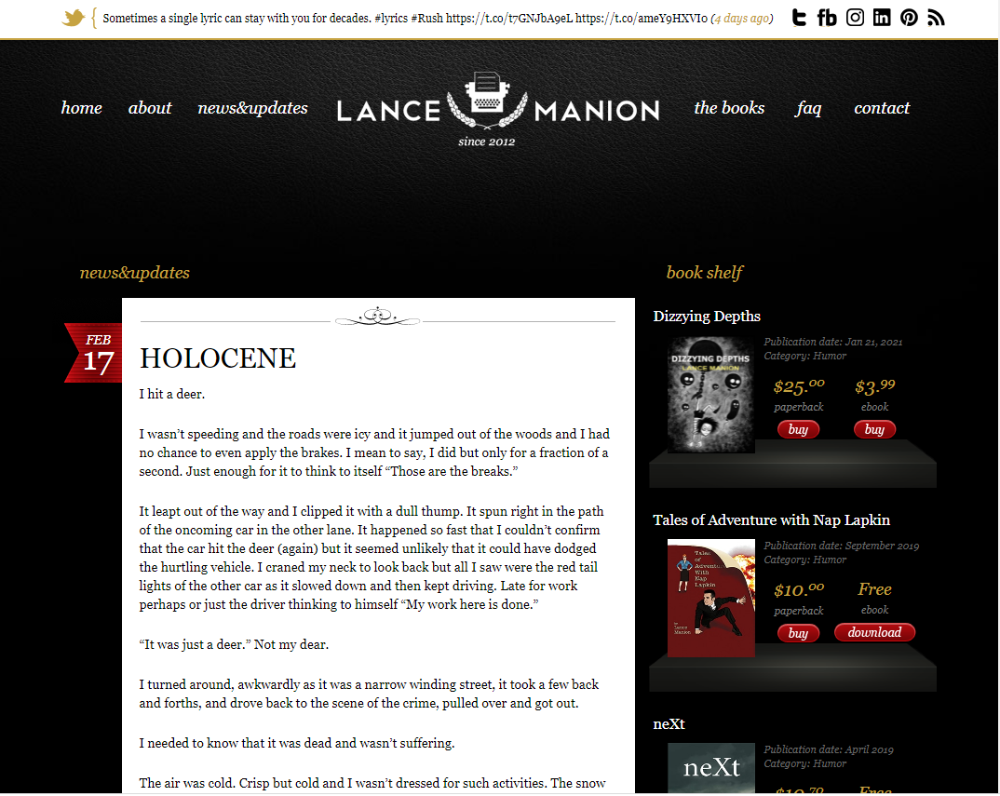
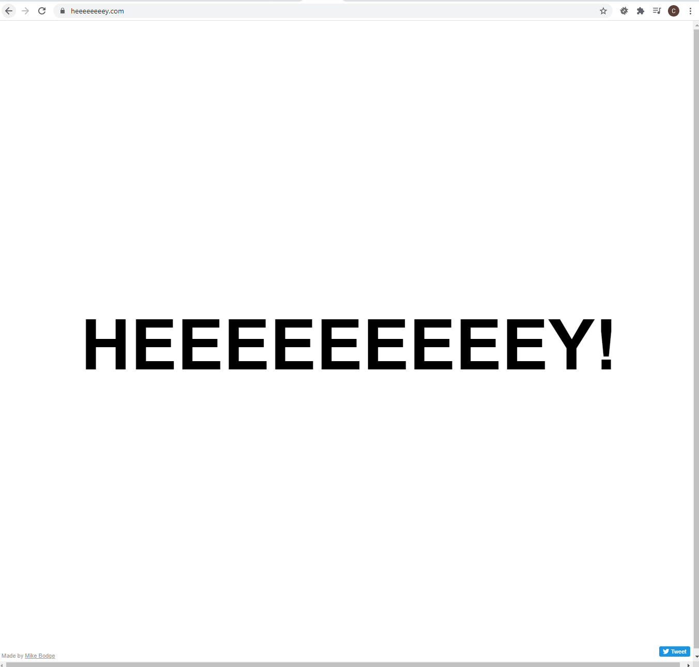
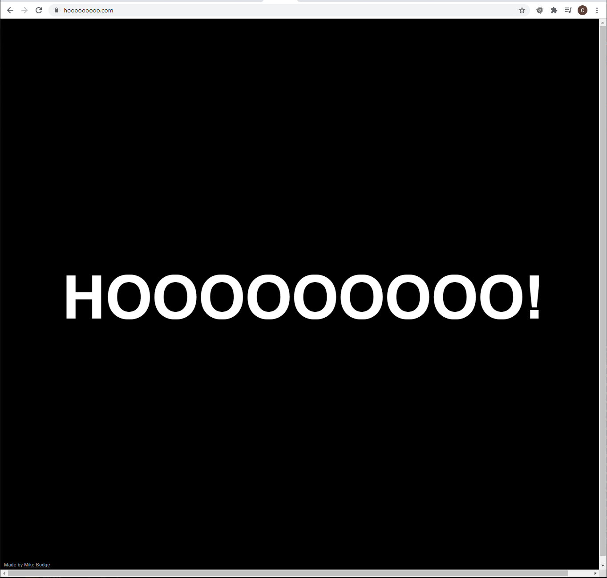
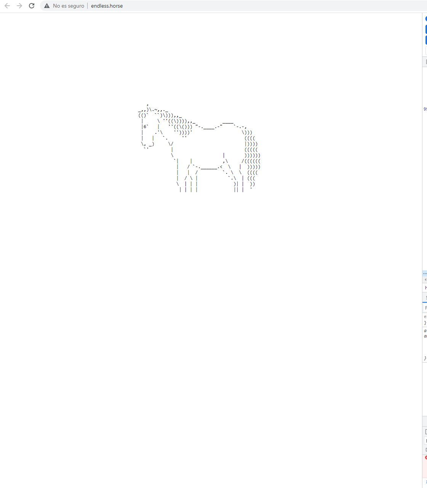
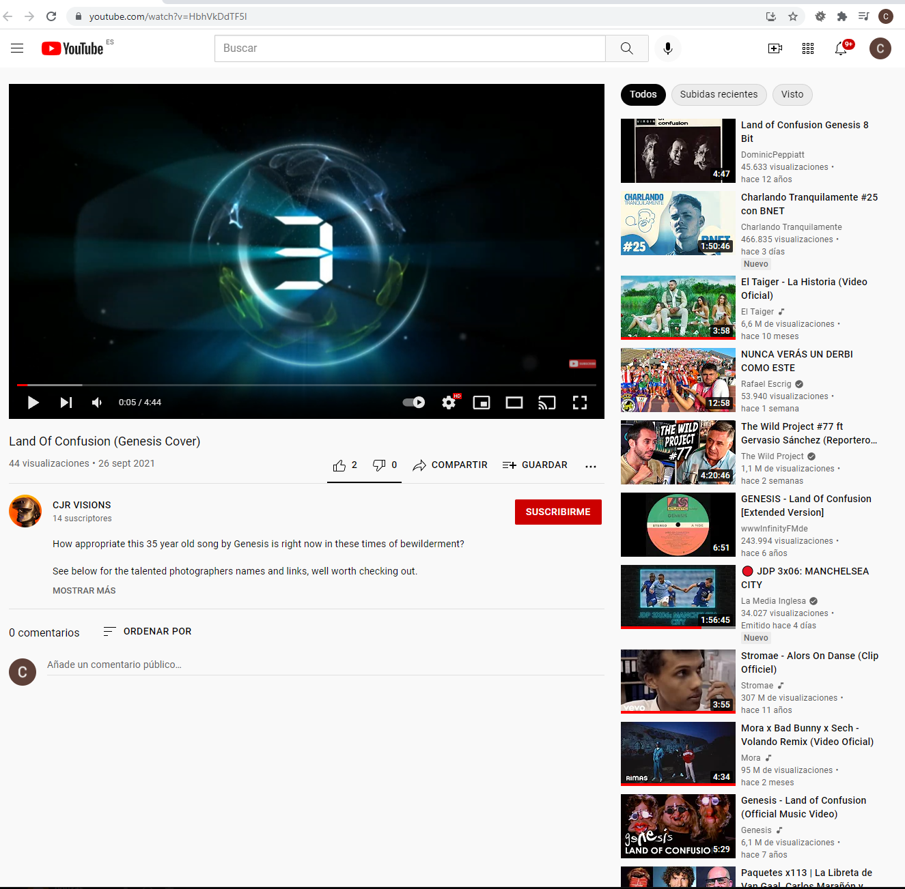

# ***Puntuar paginas:***

---

## **Paginas que no me gustan:**

## - Pagina 1:
#### URL: [Lance Manion](https://www.lancemanion.com/holocene/)

- Pagina dedicada a Lance Manion un escritor de comedia.

### Nota : 5

- No me gusta la fuente de letra.
- Parece muy antiguo.
- No conozco al autor sobre el que va la pagina.

## - Pagina 2:
#### URL: [Guia Satanica](http://theacolytesofsatan.org/)

- Pagina con los conceptos basicos del satanismo, parece ofrecer tambien base de datos y un servidor de videos. 

### Nota : 3

- Tiene una tematica que no me interesa.
- No le encuentro ninguna funcionalidad a la pagina, parece solo un 
  panfleto.

## - Pagina 3:
#### URL: [Salchicas](http://corndog.io/)

- Fondo con salchichas en palo en movimiento-

### Nota : 2

- Solo es un fondo de pantalla.

## - Pagina 4:
#### URL: [Pagina en blanco](http://www.staggeringbeauty.com/)

- Creo que la pagina quiere hacer una sucesion rapida de imagenes pero, o no funciona, o la sucesion es muy rapida y no se aprecia nada.

### Nota : 1

- No sirve para nada y lo que quiere hacer la pagina no funciona.
- No tiene ningun contenido excepto en la esquina izquierda.

## - Pagina 5:
#### URL: [heeeeeeey!](https://heeeeeeeey.com/) [hooooooo!](https://hooooooooo.com/)

- Dos paginas que se van intercalando en un periodo corto de tiempo, en una pone HEEEEY! en negro con fondo blanco y otra pone HOOOOO! en blanco con fondo negro.

### Nota : 1

- Pagina aburrida.
- No tiene ningun uso

## - Pagina 6:
#### URL: [Caballo](http://endless.horse/)

- Pagina que pinta un caballo mediante la disposicion de caracteres de teclado.

### Nota : 1

- Pagina aburrida, no hace nada.
- No tiene ningun uso.

## - Pagina 7:
#### URL: [Bucle perro](https://puginarug.com/)

- Imagen de un perro en bucle que sigue ligeramente el puntero del raton y que cuenta el tiempo que estas en la pagina.

### Nota : 0

- No tiene ningun uso
- Me marea.

___

## **Paginas que me gustan:**

## - Pagina 1:
#### URL: [youtube](https://www.youtube.com/watch?v=HbhVkDdTF5I)

- Pagina de reproduccion de videos.

### Nota : 9

- Pagina muy conocida.
- Facil navegacion.
- Es una pagina que uso muchisimo.

## - Pagina 2:
#### URL: [Mondrian](https://mondrianandme.com/)

- Pagina que mediante clicks va tirando lineas y coloreando simulando un cuadro de Mondrian.

### Nota : 7
 
- Pagina didactica.
- Muy original.

## - Pagina 3:
#### URL: [Alargar perro](https://longdogechallenge.com/)

- Pagina que alarga el perro indefinidamente y cuenta cuanto lo as alargado haciendo scroll hacia abajo en la pagina.

### Nota : 5
 
- Me resulta gracioso la funcionalidad de la pagina por eso me gusta.
- Solo sirve para alargar al perro y llegar al maximo posible, lo que la hace muy aburrida al poco.

## - Pagina 4:
#### URL: [Cronometro huevo](https://e.ggtimer.com/)

- Es un cronometro con la tematica del huevo.

### Nota : 6

- Me resulta agradable los colores y la disposición de la pagina.
- Funciona bien, aunque puede que no tenga mucho sentido tener usar un cronometro en una pagina web

## - Pagina 5:
#### URL: [Crear banners](https://www.bannereasy.com/?ref=discuvver)

- Pagina con plantillas y funcionalidades para crear banners sencillamente.

### Nota : 8

- La pagina es clara con lo que ofrece y sencilla.
- Facil navegacion por la pagina.

## - Pagina 6:
#### URL: [Libros raros](https://alwaysjudgeabookbyitscover.com/)

- Una selección de libros con tematicas muy extrañas.

### Nota : 7

- Me gusta mucho la tematica de la pagina y que haya enlaces para comprar los libros de los que habla.
- Me gusta los colores de la pagina.

## - Pagina 7:
#### URL: [Buscador de libros](https://howlongtoread.com/?ref=discuvver)

- Un buscador de libros con información y enlaces a Amazon y audiolibros.
- Tiene una función que te hace un pequeño test de velocidad de lectura y calcula el tiempo que tardarías en leer el libro consultado.

### Nota : 7

- Me gust mucho la tematica de la pagina.
- Por lo que he podido ver tiene una gran base de datos de libros.